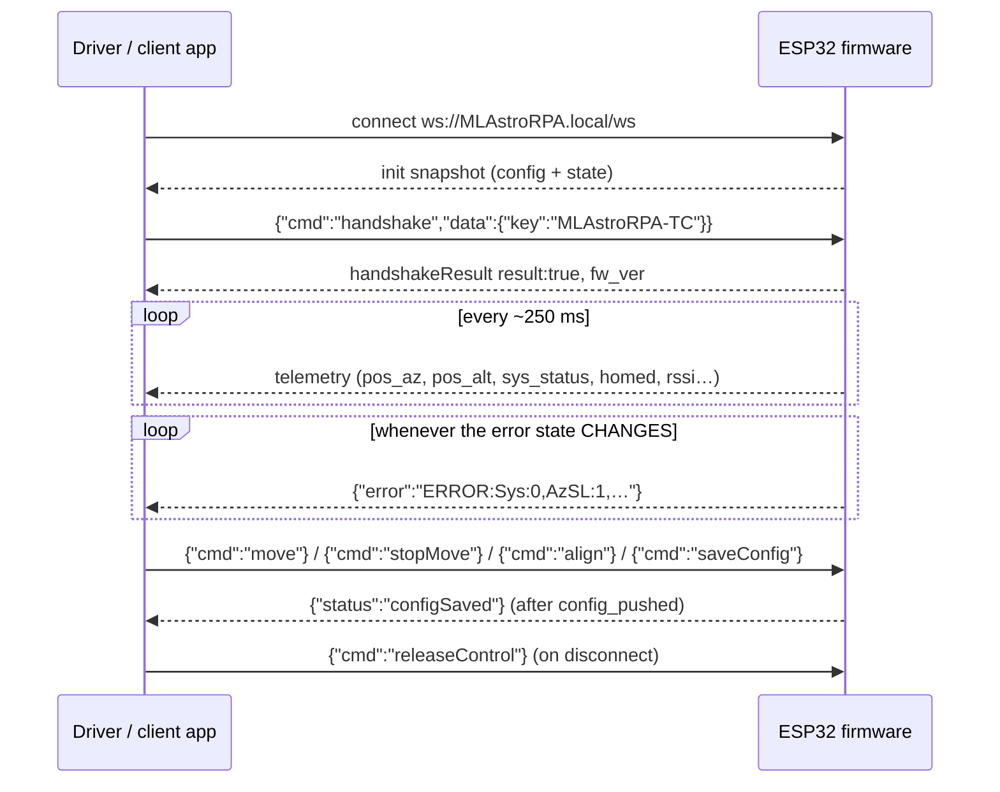

# Translator Guide — connecting a driver / client app to the MLAstroRPA firmware over WebSocket (wireless)

This document is a hand-off for the developer writing **any** client that controls the MLAstroRPA mount
**wirelessly**, without a COM port: an INDI driver, an ASCOM / Alpaca driver, a mobile or desktop app, a
script, or another planetarium/automation tool. Nothing below is framework-specific — only the WebSocket
JSON and the behaviour the firmware expects. It is based on the actual firmware protocol and on how the
NINA plugin does it (`MlastroWebSocketService.cs`), whose logic can be copied as-is.

> Sources of truth (read them, do not guess):
> - `Websocket-protocol.md` — every `cmd` + all server→client frames (copy kept next to this guide)
> - `Serial-protocol.md` — telemetry tokens + text commands (copy kept next to this guide)
> - Reference implementation of the text ↔ JSON translator:
>   [`MlastroWebSocketService.cs`](https://github.com/MLAstroRPA/nina.plugin.MLAstroRPA_TPPA/blob/main/MLAstroRPA-implement/Services/MlastroWebSocketService.cs)


---

## 1. Architecture: pick option A or B

| | A. **WS-native** (recommended) | B. **Translator layer** (what the NINA plugin does) |
| :--- | :--- | :--- |
| Driver sends/receives | JSON WebSocket directly (`{"cmd":"move",...}`) | keeps the serial text strings (`MAzL:1`, `AzPH:...`) |
| What you add | JSON parser + mapping to your own property/state model | one text→JSON layer on send, JSON→text on receive |
| Pros | least code, no missing features (2-axis `simultaneous` align, `moveRelative`, …) | reuses the existing Serial code, transport change without touching the UI |
| Cons | must rewrite command sending if the driver already has serial code | two protocols must be kept in sync (tables §4, §5) |

**Recommendation: A.** The firmware deliberately keeps its own JSON command set with clear semantics
(`axis`/`direction`/`speed`) and supports things serial does not. Pick B only when the driver already
works over serial and you want wireless to be "another transport" for the same pipeline.

If you pick B, the required architecture is:

```
client state ─ existing serial code ─► [Translator TEXT→JSON] ─► WebSocket ─► ESP32
client state ◄─ existing parser ────── [Translator JSON→TEXT] ◄─ WebSocket ◄─ ESP32
```

This is exactly the NINA plugin structure: every UI, parser and dock talks to a "virtual COM port"
(`SerialConnectionService.InjectIncomingText()`), and the WS layer only translates.

---

## 2. Connection & control session

### 2.1 Endpoint

- `ws://MLAstroRPA.local/ws` — mDNS; prefer this as the default (the address stays valid even if the IP changes).
- `ws://192.168.4.1/ws` — the device AP mode; or the IP the router assigned to the device (STA).
- An **IP fallback is mandatory** in the driver: mDNS on Windows/Android/Linux is often blocked
  (firewall, no Bonjour/avahi). On Linux, `getaddrinfo()` only resolves `.local` when avahi is running;
  otherwise let the user type an IP and try `inet_pton()` first, resolve afterwards.
- Frames: **text JSON**, 1 message = 1 JSON object (no batching needed).
- The server pings every ~15 s → enable the library keepalive/ping (lws: `LCCSCF_PING_INTERVAL`).

### 2.2 Client roles — the device allows only **one PC**

| Role | Count | Rights |
| :--- | :--- | :--- |
| Web client (browser) | 1 | controls when no PC owns control |
| **PC client (your driver/app)** | 1 | always preferred: control + monitor |

Consequences for the driver:
- Once the driver has handshaken, every other Web/PC client is locked (`{"status":"locked"}`); Web is monitor-only.
- If **Serial** owns control (`[MLAstroRPA-TC]`), the WS handshake is **rejected**.
- A second PC is rejected and the connection is closed (close code `1008`). Exception: same IP + dead old
  socket (driver restart) → the firmware takes over the old session.
- A new Web client that does not handshake within ~1.5 s gets `{"cmd":"connectionRejected"}` and is closed.

### 2.3 Handshake (first frame after connecting)

```json
{ "cmd": "handshake", "data": { "key": "MLAstroRPA-TC", "client": "MyDriver/1.0" } }
```

Successful:

```json
{ "cmd": "handshakeResult", "result": true, "transport": "ws",
  "fw_ver": "v1.3.x", "sn": "AA:BB:CC:DD:EE:FF", "serial_locked": true }
```

Rejected: `{"cmd":"handshakeResult","result":false,"reason":"..."}` (or `connectionRejected`) → the driver
must show the reason to the user and **must not** retry forever.

- Handshake timeout should be 5 s (the reference client uses 5 s).
- After a successful handshake the firmware calls `stopAllMotion(true)` so nothing moves outside your
  control → the driver must treat the initial state as "stopped" and must not assume the mount is
  still executing an old command.
- Keep `fw_ver` to display it in your UI (firmware ≥ 1.3.0 is required for all wireless features).

### 2.4 Releasing control / reboot

- Graceful release: `{"cmd":"releaseControl"}` → `{"cmd":"releaseControlResult","result":true}`; Web unlocks instantly.
- If the driver just drops the socket, the firmware releases by itself and broadcasts `controlReleased` to Web.
- Reboot: `{"cmd":"reboot"}` — only a client that **currently owns control** may reboot.
  ⛔ **Never send `releaseControl` before `reboot`**: once released, the reboot command earns
  `{"status":"locked"}` and the device does **not** restart (a real bug already hit by the NINA plugin).



---

## 3. Reading what the firmware sends

| Frame | Content | Notes for the driver |
| :--- | :--- | :--- |
| **init snapshot** (right after connect) | `serial_locked`, `role`, `control_owner`, `speedLevel`, `fw_ver`, `homed`, `wifi_ap{...}`, `ip`, `ssid`, `sta_mac`, `align_mode`, `limits`, `motor`, `backlash`, `serial`, `relative`, `align` | everything from `wifi_ap` down is the **configuration block** → load it into your settings cache |
| **`config_pushed`** | same as above | re-sent whenever the config changes from **any** path → **refresh the whole cache**, never keep the old copy |
| **single-setting delta** | `{"speedLevel":3}`, `{"relative":{...}}`, `{"align":{...}}` | the firmware sends **deltas**: only write fields that are **PRESENT**; a missing field does not mean empty/zero |
| **telemetry (250 ms)** | `pos_az`, `pos_alt`, `align_moved_az`, `align_moved_alt`, `steps_az/alt`, `out_speed_*`, `speed_*`, `homed`, `isAutoMoving`, `isCalibrating`, `sys_status`, `rssi`, `clients[]` | treat a frame as telemetry only when **`pos_az` is present**; a frame carrying only `sys_status` (STOPPED/REBOOTING) must **not** overwrite the position |
| **`error`** (edge-triggered) | `{"error":"ERROR:Sys:0,AzNC:0,…,CmdRf:0"}` | exactly the serial `ERROR:` line format → use it as the **single notification source** (Alarm panel + toast) |
| **`alert`** | `{"alert":"Soft Limit Reached! …"}` | human-readable wording only → **write it to the log file**, do not toast it (avoids two popups for one event) |
| **`log`** | `{"log":"[12:00:01] …"}` | the System log table content (same as the Web UI) |
| **`sys_status`** | `READY`, `MOVING`, `HOMING`, `ALIGNING`, `CALIBRATING`, `ALIGN_COMPLETED`, `STOPPED`, `FORCED_STOP`, `REBOOTING` | use it to know a command finished; on `REBOOTING` wait a few seconds and reconnect |
| **`configRead`** | reply to `getConfig` — sent **only to the asking client** | contains the WiFi password |

Parsing rules (**mandatory**):

1. Parse defensively: any key **may be absent**; when it is, **keep the previous value**.
2. JSON booleans stringify as `"True"/"False"` — ⛔ **never compare against `"0"`**.
   Use a typed getter (`json.value("dir", false)`) or a flag reader (bool / 0-1 number / `"1"` / `"true"`).
   This is a real bug: the align direction was always read as `true` and the user could not reverse it.
3. Filter noise: drop `log` lines containing `Manual stop sequence completed. Hardlimit re-enabled.`
   (the firmware emits them constantly and the Web UI drops them too).
4. The 250 ms telemetry must **not** be written to the log (it floods it).

### 3.1 Error codes inside `error`

`Sys, AzNC, AlNC, AzOT, AlOT, AzPW, AlPW, AzSA, AzSB, AlSA, AlSB, AzOL, AlOL, AzHL, AlHL, AzSL, AlSL, Esc, CmdRf`
— each code is `Code:value` with `0 = no error`, `1 = WARNING`, `2 = ERROR`.

`CmdRf` is a **bitfield** of "command refused because of the soft limit" (a bit clears by itself ~1.5 s after
that kind of command stops being refused):

| Bit | Meaning |
| :--- | :--- |
| `0x01` / `0x02` | relative move AZ / ALT |
| `0x04` / `0x08` | align target AZ / ALT |
| `0x10` / `0x20` | jog AZ / ALT at the limit |
| `0x40` | align overshoot branch (ALT) |

Example: `CmdRf:17` (= `0x11`) → relative AZ **and** jog AZ are both being refused. All are WARNING level and
never lock the system.

---

## 4. Command mapping: serial token → WebSocket JSON

This is the complete, usable table (matches `Websocket-protocol.md` §1.4 and `MlastroWebSocketService.Translate`).

| Serial (text) | WebSocket (JSON) | Notes |
| :--- | :--- | :--- |
| `[MLAstroRPA-TC]` | `{"cmd":"handshake","data":{"key":"MLAstroRPA-TC"}}` | once only, right after connect |
| `?` | *(send nothing)* | the firmware **pushes** telemetry by itself, ~250 ms |
| `MAzL:1` `MAzR:1` `MAlU:1` `MAlD:1` | `{"cmd":"move","data":{"axis":"az\|alt","direction":±1,"speed":1..5}}` | hold the button → send **once**, do not repeat (see §5.1) |
| `MAzL:0` … (release) | `{"cmd":"stopMove","data":{"axis":"az\|alt"}}` | per-axis **decelerating** stop; send it even if you never saw the press (safe) |
| `STOP:1` | `{"cmd":"stop","data":{}}` | soft-stop both axes, with a deceleration ramp |
| `ESTOP:1` | `{"cmd":"forceStop","data":{}}` | E-STOP: cancel the target immediately, **no** ramp |
| `STOP:0` / `ESTOP:0` | *(send nothing)* | button-release events |
| `ReER:1` | `{"cmd":"resetError","data":{}}` | unlock after a hard limit/driver error |
| `SetH:1` / `RetH:1` / `RstH:1` | `setHome` / `returnHome` / `resetHome` | |
| `SLvl:X` | `{"cmd":"speedLevel","data":{"level":X}}` | |
| `JoRe:1` `ReDe:X` `ReAM:X` `ReAS:X` | `{"cmd":"saveConfig","data":{"relative":{"mode":bool,"d":X,"m":X,"s":X}}}` | WS has **no** mode command of its own → save it to the device and **read it back** from the `relative` broadcast (§5.2) |
| `MAlU:1` **+** `JoRe:1` | `{"cmd":"moveRelative","data":{"axis":"alt","direction":±1,"angle":deg,"speed":1..5}}` | `angle` is in degrees (d + m/60 + s/3600) |
| `AzED/AzEM/AzES/AzDi` (+ `Al…`) **without** `AzAN/AlAN/AAll` | `{"cmd":"saveConfig","data":{"align":{"az":{"d","m","s","dir"},"alt":{…}}}}` | serial only **WRITES the error**, it does not move the motor |
| `AzAN:1` / `AlAN:1` / `AAll:1` | `{"cmd":"align","data":{"ra_error":arcsec,"dec_error":arcsec,"simultaneous":bool}}` | arcsec, **signed**; `AzAN`→AZ only, `AlAN`→ALT only; a non-triggered axis is sent as `0` |
| `ApplyConf:1` | `{"cmd":"applyConfig","data":{…the whole settings object…}}` | WS has no standalone "apply everything" command → send the full payload |
| config string + `Save&Reboot:1` | `{"cmd":"saveConfig","data":{...}}` **then** `{"cmd":"reboot"}` | wait for the `configSaved` ack before rebooting |
| `APss/APpa/APip/APsu` | `{"cmd":"saveConfig","data":{"wifi_ap":{…},"no_reboot":true}}` + `reboot` | writes FRAM; **`no_reboot` is mandatory** to get the ack |
| `STAs/STAp:X` | `{"cmd":"saveConfig","data":{"wifi":{"ssid":…,"pass":…},"no_reboot":true}}` + `reboot` | as above |
| `STAp:?` / `APpa:?` | `{"cmd":"getConfig","data":{"keys":["pass"]\|["wifi_ap"]}}` | returns `configRead`; **allowed without owning control** (read-only command) |
| `reboot` | `{"cmd":"reboot","data":{}}` | requires owning control |
| `Disconnect` | `{"cmd":"releaseControl"}` | |
| `Home:X`, `STAi`, `APma`, `STAm`, `Scal`, `WSta`, `AzPH`, `AlPH`, `Mpos` | *(send nothing, report no error)* | read-only/telemetry, the serial firmware ignores them too |

### 4.1 Config: serial key → JSON section/field

Use exactly this table when building `saveConfig`/`applyConfig` payloads (source: `ConfigKeyMap` in
`MlastroWebSocketService.cs`):

| Serial | Section | Field | Type |
| :--- | :--- | :--- | :--- |
| `AzL1` `AzL2` `AlL1` `AlL2` | `limits` | `az_min` `az_max` `alt_min` `alt_max` | number (degrees) |
| `AzRD` `AlRD` `AzRM` `AlRM` | `motor` | `az_reverse` `alt_reverse` `az_spread_cycle` `alt_spread_cycle` | bool |
| `AzIR` `AzIH` `AzSB` `AzSC` `AzMS` `AzAc` `AzDec` `AzSD` | `motor` | `az_run_ma` `az_hold_ma` `az_boost_pct` `az_soft_cs_pct` `az_microsteps` `az_accel` `az_decel` `az_spd` | number |
| `AlIR` `AlIH` `AlSB` `AlSC` `AlMS` `AlAc` `AlDe` `AlSD` | `motor` | `alt_run_ma` `alt_hold_ma` `alt_boost_pct` `alt_soft_cs_pct` `alt_microsteps` `alt_accel` `alt_decel` `alt_spd` | number |
| `Back` `AzBl` `AlBl` `Over` `OvUp` `OvDn` `OvD` `OvM` `OvS` | `backlash` | `enable` `az_steps` `alt_steps` `overshoot` `overshoot_up` `overshoot_down` `overshoot_d` `overshoot_m` `overshoot_s` | bool/number |
| `APss` `APpa` `APip` `APsu` | `wifi_ap` | `ssid` `pass` `ip` `subnet` | string |
| `STAs` `STAp` | `wifi` | `ssid` `pass` | string |

- `wifi` + `wifi_ap` are **save-only** sections (only effective on `saveConfig`), and by default the firmware
  **reboots by itself 500 ms later without sending an ack** → always add `"no_reboot": true`, wait for
  `configSaved`, then send `{"cmd":"reboot"}` yourself.
- An **empty** `wifi.pass` / `wifi.ssid` / `wifi_ap.*` means **KEEP** the value already stored in FRAM. The
  driver **must not send `pass:""`** while the password box has not been synced — otherwise the STA password
  is erased and every later connection fails with `reason 15 (4WAY_HANDSHAKE_TIMEOUT)`.
- Send `"origin": "myClient"` so the Web UI can tell acks apart (the firmware echoes it back in
  `{"status":"configSaved","origin":…}`).
- Any section you do not send **keeps its stored value**.

---

## 5. Details that are easy to get wrong (read before coding)

### 5.1 Jog: send once, release with `stopMove`

- Press: send `move` **once**. A driver-side watchdog (if any, 250 ms) **must dedupe** the same
  axis+direction — the firmware **refuses every motion command while running**, so repeats only spam
  `alert`/`error`.
- Release: send `stopMove` (per-axis deceleration). A jog release is **not** `stop` (that is the STOP button).
- If a jog is refused by the soft limit: temporarily lock the jog controls (the reference client re-enables
  them after 2 s or when the axis moves away) and report it from the `CmdRf` bits `0x10/0x20`.

### 5.2 Relative mode: WS has no mode command

The firmware is the **source of truth**. The correct sequence:

1. The driver sends `saveConfig{relative:{mode,d,m,s}}`.
2. The firmware writes FRAM and broadcasts `{"relative":{...}}` to **every** client.
3. The driver **reads it back** from the broadcast (and from the `relative` block of the connect snapshot) to
   update the UI. Do not rely on local state only — a Web client monitoring at the same time would then show
   a different value.

### 5.3 Align: `saveConfig` (write the values) is **not** `align` (move the motors)

This is where the NINA plugin once went wrong (typing a number into an error box moved the mount):

- `AzED/AzEM/AzES/AzDi` (+`Al…`) = **write the error into FRAM**, no motor movement
  → `saveConfig{align:{az:{d,m,s,dir}, alt:{d,m,s,dir}}}`.
- `AzAN`/`AlAN`/`AAll` = **trigger** the move using the values already stored
  → `align{ra_error, dec_error, simultaneous}`, arcsec, **signed** (`+` = positive direction).
- Serial writes **one field at a time** → any field you omit must **keep its value** (do not clear it to 0).
  So a `saveConfig{align}` payload must always send **both az and alt** (merge the tokens just received with the
  values already cached).
- A negative value in serial means a reversed direction, using the magnitude of the number (`dir = false`).
- Completion detection: `sys_status` = `ALIGN_COMPLETED`, **or** `READY` after a busy state
  (`ALIGNING/MOVING/HOMING/CALIBRATING`) was observed, **or** `READY` after ~1.5 s (tiny moves never show an
  ALIGNING phase). The reference client synthesizes `AAll:COMPLETED` on that condition.
  → Your driver should apply a timeout (10 min by default) and stop the routine when it expires.

### 5.4 Acks & `config_pushed`

- `saveConfig` → the firmware pushes `config_pushed` **first**, then acks with `{"status":"configSaved"}`.
- `applyConfig` → `{"status":"configApplied"}`.
- Wait up to 8 s for the ack; on timeout report an error to the user and **do not** reboot blindly.

### 5.5 One event = one notification

For the same event the firmware may emit `alert` + `error` + `log` (e.g. jog hitting the soft limit). Use the
**error code channel (`error`)** as the only user notification (it exists on **both** serial and WS) and only
write `alert` to the log file. Otherwise the user sees two popups for a single button press.

### 5.6 Misc

- The log table should hold **at most ~50 lines**, newest on top (same as the Web UI).
- When Web presses RESET/reboot while the driver owns control it gets `locked`; the driver should show the
  ownership state (`role`, `control_owner`) in the UI.
- After `reboot`: wait ~3-5 s and reconnect (all firmware-side session state lives in RAM).
- Units: `pos_az/pos_alt`, `AzPH/AlPH` = **degrees**; `align_moved_*` = degrees; `align` = **arcsec**;
  `moveRelative.angle` = **degrees**.

---

## 6. Suggested mapping to your client's own model

Any equivalent structure works (INDI properties, ASCOM members, app state objects). Example names:

| Suggested property | Source |
| :--- | :--- |
| `CONNECT` / `DISCONNECT` | handshake / `releaseControl` |
| `DRIVER_INFO` (read-only) | `fw_ver`, `sn`, `role`, `control_owner`, `rssi`, socket state |
| `ALIGN_ERROR` (d/m/s + direction, read-write) | `align.az/alt {d,m,s,dir}`; commit → `saveConfig{align}` + `align` when the user triggers the correction |
| `JOG` (4 directional actions) | press → `move`, release → `stopMove`; read `pos_az/pos_alt` to update the UI |
| `SPEED` (1..5) | `speedLevel` |
| `RELATIVE` (mode + d/m/s) | `saveConfig{relative}` + read the `relative` broadcast |
| `LIMITS` / `MOTOR` / `BACKLASH` | the matching section in the snapshot/`config_pushed`; write → `saveConfig` |
| `WIFI` (STA + AP) | `wifi_ap{ssid,ip,subnet,mac}`, `ip`, `ssid`, `sta_mac`; password only through `getConfig` |
| Alarm / log view | `error` + `log` (keep at most 50 lines) |

---

## 7. Implementation checklist

1. [ ] WebSocket client + reconnect (backoff) + keepalive/ping.
2. [ ] Resolve `MLAstroRPA.local`, fall back to a user-entered IP; connect + handshake timeout 5 s.
3. [ ] Handshake + handle `handshakeResult:false` / `connectionRejected` (show the `reason`).
4. [ ] Parse the snapshot → cache the config; refresh the cache on `config_pushed`/deltas (`speedLevel`, `fw_ver`).
5. [ ] Defensive parsing: a missing field keeps the previous value; read booleans with typed getters.
6. [ ] Telemetry → your state/property model; only frames containing `pos_az` carry a position.
7. [ ] Commands: `move`/`stopMove`/`stop`/`forceStop`/`resetError`/`speedLevel`/home.
8. [ ] The two align paths: `saveConfig{align}` (write) and `align{ra_error,dec_error,simultaneous}` (run).
9. [ ] Relative: push `saveConfig{relative}` + read back from the broadcast.
10. [ ] Config: `saveConfig`/`applyConfig`, `no_reboot` for `wifi`/`wifi_ap`, wait 8 s for the ack, send `origin`.
11. [ ] Password: only through `getConfig`→`configRead`; never send `pass:""`.
12. [ ] Reboot/Reset ESP32: do not `releaseControl` first; reconnect a few seconds later.
13. [ ] Notifications: use `error` (codes) as the only source; `alert` goes to the log.
14. [ ] Test:

**Quick test recipe**

- Open the Web UI (`http://MLAstroRPA.local/`) in parallel to compare: while your client owns control, the Web
  UI must show "monitor/locked" and still update position + log.
- Compare against the reference client (the NINA plugin): its CONTROL tab shows position + alarms and its
  CONFIGURATION tab shows soft limits / motor driver settings — the same values must match yours.
- To watch the raw JSON flow: enable the WS library logging, or use `websocat ws://MLAstroRPA.local/ws` and
  paste the handshake to observe telemetry.
- A mock WebSocket server from the firmware project (`TestTool/mock_server.py`, not included here) can be used
  to exercise the parser without hardware.
